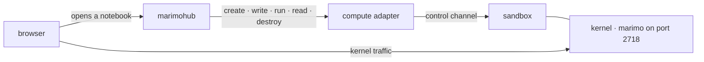
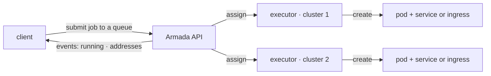
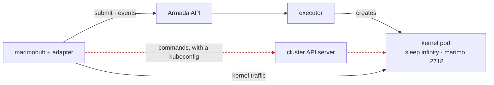
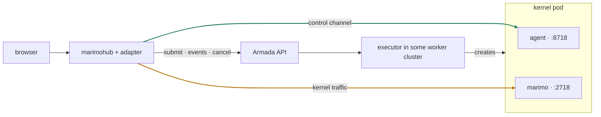
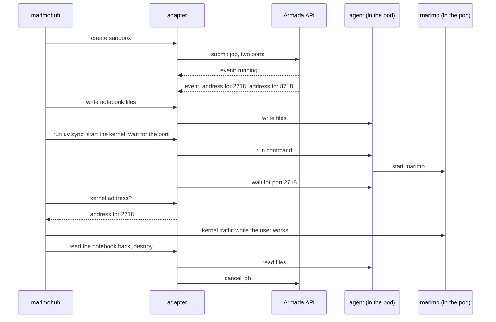
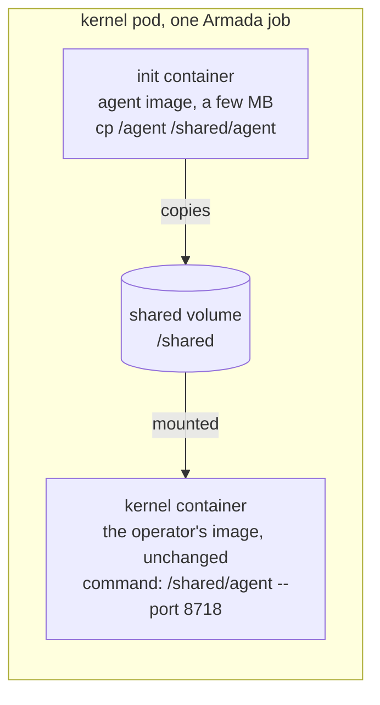

# Kernel agent: how marimohub reaches a notebook that Armada placed

**Status: built in full.** Every step of the order of work at the end is done and verified on a live cluster.
This document is the design as it was written, kept for the reasoning; the adapter as it is today is described in `docs/ARCHITECTURE.md`, and what was built, and where it departs from this text, is in `ARMADA-REVIEW.md` decisions 28 to 34.
Two departures matter to a reader of this document: the pod carries a hash of the agent's secret, not the secret, and a sandbox's queue is settled from what is known of its job before the owner map is consulted.

## The three systems

### marimo

marimo is a Python notebook.
A notebook is a file of code cells that a user edits and runs in a browser.
The program that serves the editor page and runs the code is one process.
This document calls that process the kernel.
`marimo edit notebook.py` starts a kernel.
The kernel listens on port 2718, and the browser connects to that port to show the editor.
marimo knows nothing about users, teams, or servers.

### marimohub

marimohub is a web server from the marimo team.
It stores notebooks with a version history, manages projects and their members, signs users in, and starts a kernel for a user on demand.
It never runs Python itself.
When a user opens a notebook, marimohub creates an isolated place for the kernel, puts the notebook file there, and starts the kernel.
This document calls that isolated place a sandbox.

Where a sandbox runs is a choice.
The piece of code that makes that choice is a compute adapter.
marimohub ships adapters for Docker, Kubernetes, and several hosted services, and it can load one from a file that an operator provides.
This repository is such an adapter.

marimohub asks an adapter to do a fixed list of things for one sandbox:

1. Create the sandbox.
2. Write files into it.
3. Run a command in it and return the output.
4. Start the kernel in it and wait until its port answers.
5. Return an address at which the kernel can be reached.
6. Read files back out of it.
7. Destroy it.

Steps 2, 3, 4, and 6 need a way to run commands inside the sandbox.
That way is the control channel.
Step 5 lets the browser reach the kernel.
That traffic is the kernel traffic.



### Armada

Kubernetes runs containers on a set of machines.
A container is one isolated process tree with its own filesystem, made from an image.
A pod is the unit Kubernetes runs: one or more containers on one machine.
A cluster is one Kubernetes installation with its own API server.

Armada is a batch scheduler above many clusters.
A user submits a job, which is a pod description plus a queue name.
A queue is a named line of jobs that belongs to a user or a team.
Armada decides when and on which cluster the job runs.
In each cluster a component called the executor creates the pods for the jobs assigned to that cluster.

A job can ask Armada for network objects next to the pod.
A service gives the pod an address.
A service of type NodePort opens a port on the machine that runs the pod, so the pod can be reached from that machine's network.
An ingress gives the pod a hostname with HTTPS.

Armada reports what happens to a job as a stream of events.
One event says the job runs and names the cluster and the pod.
Another reports the address of each port the job asked for.

Armada has no way to run a command inside a pod.
Its API is submit, cancel, query, and events.



## How the adapter worked before the agent

This is the state the design set out to replace, kept so the problem below reads as it was.

The adapter submits one Armada job per sandbox.
The job is one pod with one container from the kernel image, the image the operator provides with Python, `uv`, and marimo in it.
The container's command is `sleep infinity`.
It does nothing and only keeps the container alive until marimohub starts the kernel in it.
The job asks for a NodePort service on port 2718.

The adapter reads the event stream.
It learns the cluster and the pod name when the job runs, and the address for port 2718 from the address event.
That address is the kernel address.

For the control channel the adapter does what marimohub's own Kubernetes adapter does.
Kubernetes can run a command inside a live container through the cluster's API server.
That needs a credential for the cluster, stored in a file called a kubeconfig.
The adapter maps the cluster name from the event to a kubeconfig file and runs every command that way.



The dashed path is the control channel.
`ARMADA-REVIEW.md` records this choice as decision 11 and asks whether it is acceptable.

## The problem

Armada exists to hide the clusters from the tools that use it.
If marimohub holds a kubeconfig for every worker cluster, it bypasses Armada and has direct power over every cluster.

The design follows three rules:

1. marimohub may talk to the Armada API.
2. marimohub may connect to an address that Armada reported in an event.
3. marimohub holds no Kubernetes credential of any shape.

Under these rules the control channel has nowhere to go.
The only thing Armada gives is an address for a port the job asked for.
So the pod must offer its own way to run commands, on a port, and Armada must expose that port next to the kernel's port.

## The solution

### The idea

A small program runs inside the kernel container in place of `sleep infinity`.
This document calls it the agent.
Like `sleep`, it keeps the container alive.
Unlike `sleep`, it listens on port 8718, accepts a request that says "run this command", and replies with the output.
The job asks Armada to expose both ports, 2718 and 8718.
The address event then reports two addresses.
The address for 2718 is the kernel address.
The address for 8718 is the control channel.
The cluster name is never used.



marimohub, marimo, and the kernel image do not change.
The adapter changes, and one new program is added.

### One session



While the user works, the browser talks to the kernel through marimohub.
The Armada API and the agent are idle during that time.

### How the agent runs in an unchanged image

A pod description can set the command for a container, and that command replaces the image's entrypoint.
The adapter already uses this to run `sleep infinity`.
It now runs the agent instead.

The agent binary comes from its own tiny image.
Kubernetes can run a setup container before the main container, called an init container, and can share a directory between containers, called a volume.
The init container copies the agent into a shared volume.
The kernel container runs it from there.



```json
{
	"volumes": [{ "name": "shared", "emptyDir": {} }],
	"initContainers": [
		{
			"name": "agent-install",
			"image": "ghcr.io/<org>/marimohub-kernel-agent:<tag>",
			"command": ["cp", "/agent", "/shared/agent"],
			"resources": {
				"requests": { "cpu": "100m", "memory": "64Mi" },
				"limits": { "cpu": "100m", "memory": "64Mi" }
			},
			"volumeMounts": [{ "name": "shared", "mountPath": "/shared" }]
		}
	],
	"containers": [
		{
			"name": "kernel",
			"image": "<the operator's kernel image>",
			"command": ["/shared/agent", "--port", "8718"],
			"env": [{ "name": "MH_AGENT_TOKEN", "value": "<random per session>" }],
			"ports": [{ "containerPort": 2718 }, { "containerPort": 8718 }],
			"volumeMounts": [{ "name": "shared", "mountPath": "/shared" }]
		}
	]
}
```

The init container sets resources because Armada validates init containers the same way as main containers.
Every container must set requests and limits, and they must match (`internal/server/submit/validation/submit_request.go:255`).
A server can also require init containers to request a fractional CPU (`submit_request.go:413`, behind `AssertInitContainersRequestFractionalCpu`), so the value is `100m` and not `1`.
A submit that omits this is rejected before Armada looks at anything else in the job.

The agent then runs inside the kernel image's filesystem.
It sees the image's `PATH`, its `uv`, and its Python environment, and it runs each command with the image's own `sh`.
So `uv sync` and `marimo edit` resolve exactly as they do today.

The agent must run in the kernel container and not in a second container next to it.
A second container has its own filesystem and sees none of the kernel image's tools.

The agent is a Go program built as one static binary.
It depends on no library in the kernel image, so the same file runs in any Linux image.
If Armada refuses the shared volume, the fallback is one `COPY` line in the kernel image and a command that points at that path.

### Why the agent is process 1

The first process in a container has process id 1, and Linux gives it one duty.
When a child process exits, process 1 must collect its exit status.
`sleep` never does that, so a crashed kernel stays in the process table as a dead entry that still looks alive.
The agent collects exit statuses.
It knows the moment the kernel dies and the code it died with.

### The agent's requests

The first version has one request type.
It runs a shell command and returns what the command printed and its exit code.

```
POST /exec

{ "cmd": ["sh", "-c", "cat > /workspace/notebook.py"], "stdin": "<base64>", "timeoutMs": 0 }

OK 200 { "stdout": "", "stderr": "", "exitCode": 0 }
```

This is enough for a full session, because every adapter operation is a shell command today.
The adapter keeps all of that and only changes how the command reaches the pod.

Later versions add requests that the agent can answer better than a shell, because it is the parent of every process it starts:

- start a process, ask whether it is alive, stop it, read what it printed
- wait inside the pod until a port answers
- stream a command's output, and stop the command when the caller disconnects
- write, read, and list files as raw bytes and structured data

These remove the adapter's workarounds for commands that outlive a dropped connection, and the shell quotes around file names and content.

### How the agent checks the caller

The agent port gives command access to a pod that runs a user's code.
The adapter generates a random secret per sandbox and puts its SHA-256 hash, not the secret, in the pod description as an environment variable.
Every request must carry the secret in a header; the agent hashes it and refuses a request whose hash does not match.
Anyone who can read the job's pod description sees only the hash.
The secret is valid for one pod and for the life of that pod.
marimohub holds nothing that reaches more than one pod.

### How the two ports are exposed

The job asks Armada for an ingress for both ports.
Armada creates it, gives each port its own hostname with HTTPS, and reports both hostnames in the address event.
The cluster needs an ingress controller, a wildcard DNS record, and a wildcard certificate.
That is the same setup marimohub's own Kubernetes adapter asks for.

On a local cluster with no ingress controller, the job can ask for a NodePort service instead, which the adapter uses today.
The adapter code is the same in both cases, because it reads one address per port either way.

marimohub has two modes for kernel traffic.
In proxy mode the browser talks to marimohub, and marimohub forwards to the kernel address after it checks the user.
In subdomain mode the browser connects to the kernel address directly, which needs a hostname on a different domain from marimohub.
Proxy mode is the mode to use first.

## One queue per team/user

Armada shares the clusters between queues, so the queue is how Armada tells users apart.
The adapter submits every sandbox to one queue, because marimohub does not tell it whose sandbox it is.
A small change in marimohub adds the project id and the user id to the sandbox request.
The adapter then maps them to a queue and remembers the queue per sandbox.
Until then, one marimohub installation per team, each with its own queue, gives team queues with no code change.

Built as step 5: marimohub's `CreateSandboxOptions.owner` (merged upstream as marimohub#301, released in 0.4.0) and the adapter's `ARMADA_QUEUE_BY_USER` and `ARMADA_QUEUE_BY_PROJECT` maps.
Every Armada call about a job needs its queue, and the queue a job is in is a fact while the map is only today's configuration, so the adapter asks what it remembers, then Lookout by job set, and lets the owner map place only a job that does not exist yet.
A map therefore requires Lookout, and a question Lookout cannot answer fails the call rather than guess.
`ARMADA-REVIEW.md` decision 31 records the build and decision 34 the corrected order.

## What else was considered

Armada could add command execution to binoculars, its per-cluster component that reads pod logs.
marimohub would then talk only to Armada components.
That is the best answer for security and the slowest to deliver, because it is an Armada feature with its own release.
The adapter above the control channel is the same either way, so the agent does not block it.

The agent could open a connection out to marimohub instead of a connection in.
That is the only answer where nothing may connect in to a pod.
It needs a place in marimohub to accept the connection, which does not exist today.

marimohub could run inside one worker cluster with that cluster's own credential.
That is still a Kubernetes credential, and it works for one cluster only.

## Order of work

1. [x] Submit one test job with two ports, an init container, and the shared volume.
       Confirm two addresses come back in the address event.
2. [x] Build the agent with the single request type and replace the Kubernetes channel in the adapter.
       Run a full notebook session on a local cluster.
3. [x] Add the process and file requests and delete the workarounds.
4. [x] Test the ingress with a real ingress controller.
5. [x] Make the marimohub change for queues, then add the queue map.

After step 2 the system talks only to Armada.
