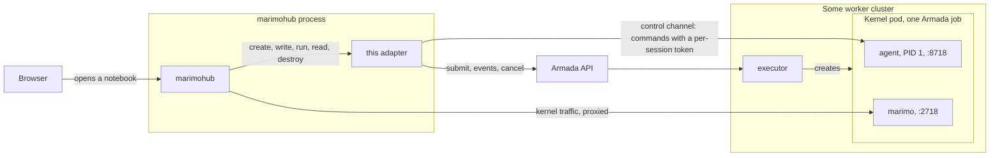
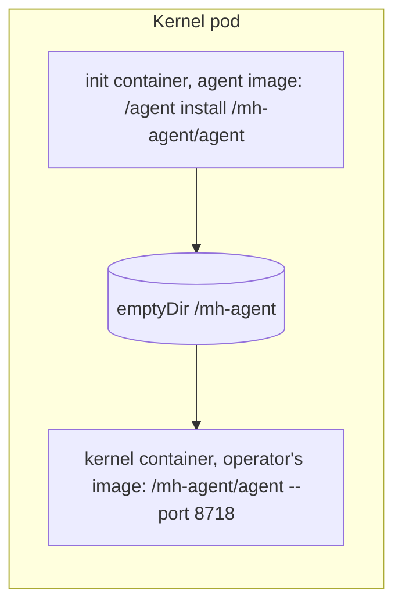
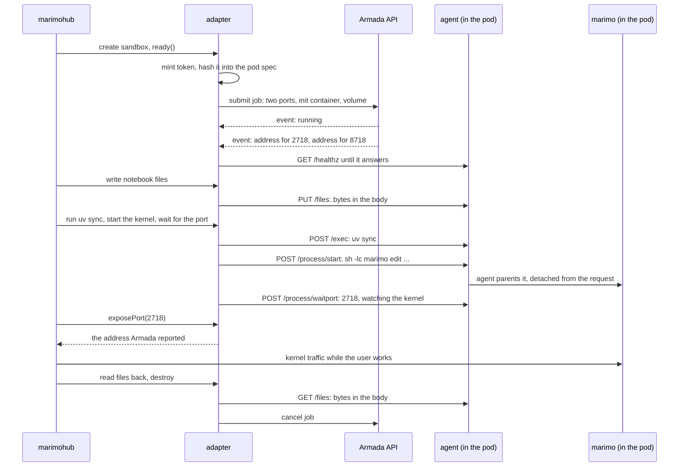

# Architecture

How marimohub reaches a notebook kernel that Armada placed. This is the map; the
reasoning behind each choice, with citations into the Armada source, is in
[ARMADA-REVIEW.md](../ARMADA-REVIEW.md), and the design of the agent is in
[AGENT-DESIGN.md](../AGENT-DESIGN.md).

## The three systems

**marimo** is a Python notebook. The process that serves the editor page and runs
the code is one process, the kernel, listening on port 2718.

**marimohub** is a web server that stores notebooks, manages projects and users, and
starts a kernel for a user on demand. It never runs Python itself. When a user opens
a notebook it creates an isolated place for the kernel, the sandbox, puts the files
there and starts the kernel. Where a sandbox runs is a compute adapter's choice, and
this repository is such an adapter, loaded as a library into marimohub's own process.

**Armada** is a batch scheduler above many Kubernetes clusters. A job is a pod
description plus a queue name. Armada decides when and on which cluster it runs, and
an executor in that cluster creates the pod. Armada can also create a service or an
ingress next to the pod and report each port's address in an event. It has no way to
run a command inside a pod, and it exists to keep cluster credentials away from the
tools that use it.

## The shape

The adapter holds two kinds of address and nothing else: the Armada API, and the
addresses Armada reported in an event for the two ports of one pod. There is no
kubeconfig, no cluster id in use, and no way for marimohub to reach any pod but its
own.

## The two halves of the adapter

**Placement** (`src/armada.ts`) submits one job per kernel session, follows the job
set's event stream until the pod is running, reads the address event, and cancels the
job on destroy. The job's ids are all the sandbox id: `clientId` so a resubmit dedupes,
`jobSetId` so the session has its own event stream, and `externalJobUri` so the job
can be found again. `listActive`, when Lookout is configured, asks Lookout.

**Control channel** (`src/channel.ts`) is the client for the agent, and the only thing
that reaches into a pod. It has `ready`, which polls the agent's health endpoint until
the route to the pod works; `run` and `stream`, which execute a shell command and
collect or forward its output; and typed operations for the rest: `writeFile`,
`readFile` and `listFiles` carry bytes to and from the agent's `/files` endpoints, and
`startProcess`, `waitForPort`, `processLogs` and `signalProcess` drive a detached
process the agent parents.

`src/sandbox.ts` sits above the channel. Running user code is still a shell command
(`exec`, `execStream`, and the quoted `git clone`), so `src/shell.ts` keeps the env
prefix and quoting for that, transcribed from marimohub's own Kubernetes adapter.
Everything else, files and the kernel's lifecycle, goes to the agent's typed endpoints
rather than through a shell, so no path is quoted and no content is wrapped in base64.

## The agent

Armada has no exec, so the pod brings its own. The kernel container's command is
`/mh-agent/agent --port 8718` instead of `sleep infinity`. An init container from the
agent's own image copies the binary into an `emptyDir` that both containers mount, so
the operator's kernel image is used unchanged and the agent runs with the image's own
`sh`, `PATH`, `uv` and Python.

The agent is a Go program with no dependencies, built as one static binary (`agent/`).
It does five things:

- **Runs commands.** `POST /exec` takes `{cmd, stdin, timeoutMs}` and streams NDJSON
  back: the pid, then stdout and stderr chunks as base64, then the exit status. Every
  command starts as the leader of a new session.
- **Runs detached processes.** `/process/{start,status,logs,signal,waitport}` starts a
  process the agent parents, so its liveness and exit code come from a real `wait` and
  its port can be waited for in-pod. This is the kernel's lifecycle. A signal goes to
  the process group, so stopping the kernel takes whatever it spawned with it.
- **Reads and writes files.** `/files` carries bytes raw in the request or response
  body and takes the path as a query parameter, so nothing is quoted for a shell or
  wrapped in base64.
- **Kills what its caller abandoned and checks the caller.** When a request ends,
  because the caller disconnected or the deadline passed, the agent `SIGTERM`s the
  command's process group and `SIGKILL`s it five seconds later; a Kubernetes exec could
  never do this, and it is why `/exec` streams. Every request carries a bearer token,
  and the pod spec holds only its SHA-256 (`MH_AGENT_TOKEN_SHA256`), because the spec is
  readable through Armada's API and an env var is inherited by every process in the pod.
- **Is PID 1.** It reaps orphaned zombies, so a crashed kernel is collected rather
  than left looking alive, and it forwards `SIGTERM` to every process when Kubernetes
  stops the container, inside the pod's grace period.

## One session

While the user works, the Armada API and the agent are idle. Only the kernel port
carries traffic.

## Kernel traffic

marimohub has two modes for reaching the kernel. In **proxy** mode the browser talks
to marimohub, which forwards to the address the adapter returned after checking the
user; that is what runs locally, and it is the mode to use first. In **subdomain**
mode the browser connects to the kernel address directly, which needs an ingress with a
hostname on a different domain from marimohub's.

The adapter never templates a hostname. Armada names the host of an ingress rule, and
the adapter returns whatever the address event says: `hostIP:nodePort` for a NodePort
service, the rule host for an ingress. Which of the two the job asks for is
`ARMADA_EXPOSE`, and it covers the agent port and the kernel port together: a NodePort
service is plain HTTP on the cluster network, an Ingress is an HTTPS hostname per port
served by the cluster's ingress controller, with the certificate and the DNS suffix
coming from the executor's configuration rather than from this adapter.

## Abandoned commands

Most of marimohub's calls carry no timeout, and a marimohub restart abandons every
command it had open. The agent handles both: a command dies when its request's context
ends, and a restart is precisely every request ending at once. So an abandoned command
is stopped by the agent killing its process group, with nothing for the adapter to clean
up afterwards.

A command with no caller timeout is sent with `ARMADA_COMMAND_MAX_SECONDS` as its
deadline (default 6 hours, `0` off), so a command nobody is waiting on any more cannot
hold a process for the rest of the session. It is a backstop, not a timeout: the value
is far past anything marimohub's own commands take. Streams are exempt, since how long
one stays open is its reader's decision.

## What the kernel image must provide

`/bin/sh`, so `exec` can run a command, and `git`, for a session that loads from a
repository. That is all: the file and process endpoints are the agent's own code. The
adapter never probes for either; a missing `sh` or `git` surfaces as that command's own
failure. The agent itself needs nothing from the image.

## How the adapter is loaded

There is one process: marimohub's own Node server. At startup it sees
`MARIMOHUB_COMPUTE_BACKEND=library`, imports the bundle named in
`MARIMOHUB_COMPUTE_LIBRARY`, checks the default export is
`{ apiVersion: 1, kind: 'compute' }`, and calls `create(context)`. The provider it gets
back lives on marimohub's heap. Two consequences: a configuration error is a startup
error, and the adapter runs with the server's full privileges.

## Where to look

| Path                  | What it is                                                                     |
| --------------------- | ------------------------------------------------------------------------------ |
| `src/types.ts`        | marimohub's adapter interface, transcribed by hand. Not ours.                  |
| `src/armada.ts`       | Placement: submit, watch, addresses, cancel, `listActive`.                     |
| `src/channel.ts`      | Control channel: the client for the agent's exec, process and file endpoints.  |
| `src/sandbox.ts`      | One kernel session: `exec` on the agent, files and processes on its endpoints. |
| `src/shell.ts`        | Env prefix, quoting and the clone command, from marimohub's `compute-commons`. |
| `src/podspec.ts`      | The pod spec: both containers, both ports, the volume, the hash.               |
| `src/armada-types.ts` | Hand-written Armada wire types, checked against the pinned spec.               |
| `agent/`              | The agent: a Go program run as PID 1 of the kernel container.                  |
