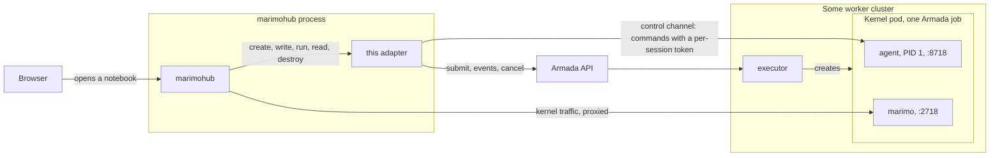
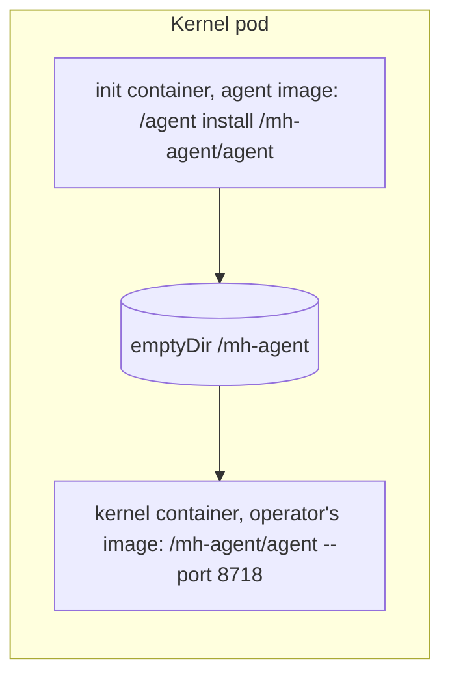
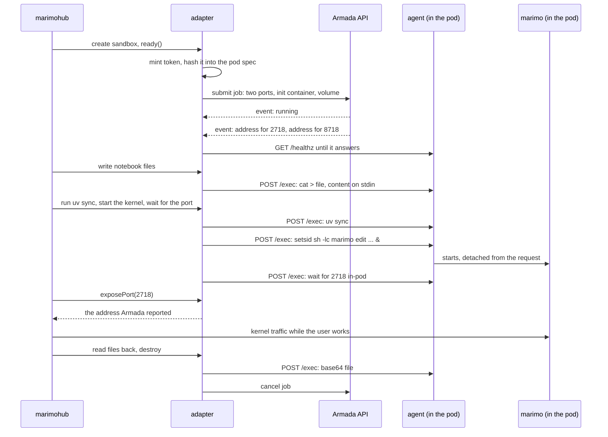

# Architecture

How marimohub reaches a notebook kernel that Armada placed. This is the map; the
reasoning behind each choice, with citations into the Armada source, is in
[ARMADA-REVIEW.md](../ARMADA-REVIEW.md), and the design of the agent is in
[AGENT-DESIGN.md](../AGENT-DESIGN.md).

## The three systems

**marimo** is a Python notebook. The process that serves the editor page and runs
the code is one process, the kernel, listening on port 2718.

**marimohub** is a web server that stores notebooks, manages projects and users, and
starts a kernel for a user on demand. It never runs Python itself. When a user opens
a notebook it creates an isolated place for the kernel, the sandbox, puts the files
there and starts the kernel. Where a sandbox runs is a compute adapter's choice, and
this repository is such an adapter, loaded as a library into marimohub's own process.

**Armada** is a batch scheduler above many Kubernetes clusters. A job is a pod
description plus a queue name. Armada decides when and on which cluster it runs, and
an executor in that cluster creates the pod. Armada can also create a service or an
ingress next to the pod and report each port's address in an event. It has no way to
run a command inside a pod, and it exists to keep cluster credentials away from the
tools that use it.

## The shape

The adapter holds two kinds of address and nothing else: the Armada API, and the
addresses Armada reported in an event for the two ports of one pod. There is no
kubeconfig, no cluster id in use, and no way for marimohub to reach any pod but its
own.

## The two halves of the adapter

**Placement** (`src/armada.ts`) submits one job per kernel session, follows the job
set's event stream until the pod is running, reads the address event, and cancels the
job on destroy. The job's ids are all the sandbox id: `clientId` so a resubmit dedupes,
`jobSetId` so the session has its own event stream, and `externalJobUri` so the job
can be found again. `listActive`, when Lookout is configured, asks Lookout.

**Control channel** (`src/channel.ts`) is the client for the agent. It has three
operations: `ready`, which polls the agent's health endpoint until the route to the
pod works; `run`, which sends a command and collects its output and exit code; and
`stream`, which forwards stdout as it is produced. It is the only thing that reaches
into a pod.

Everything above those two, in `src/sandbox.ts`, is shell commands: write files
through `cat`, read them back as base64, list with `find`, launch the kernel with
`setsid`, wait for its port with a `python3` one-liner, clone with `git`. The quoting
and command builders are in `src/shell.ts`, transcribed from marimohub's own
Kubernetes adapter so behaviour matches upstream.

## The agent

Armada has no exec, so the pod brings its own. The kernel container's command is
`/mh-agent/agent --port 8718` instead of `sleep infinity`. An init container from the
agent's own image copies the binary into an `emptyDir` that both containers mount, so
the operator's kernel image is used unchanged and the agent runs with the image's own
`sh`, `PATH`, `uv` and Python.

The agent is a Go program with no dependencies, built as one static binary (`agent/`).
It does four things:

- **Runs commands.** One endpoint, `POST /exec`, takes `{cmd, stdin, timeoutMs}` and
  streams NDJSON back: the pid, then stdout and stderr chunks as base64, then the exit
  status. Every command starts as the leader of a new session.
- **Kills what its caller abandoned.** When the request ends, because the caller
  disconnected or the deadline passed, the agent sends `SIGTERM` to the command's
  process group and `SIGKILL` five seconds later. A Kubernetes exec could never do
  this, and it is why the response streams rather than buffers.
- **Checks the caller.** Every request carries a bearer token. The adapter mints one
  per sandbox and puts only its SHA-256 in the pod spec, as `MH_AGENT_TOKEN_SHA256`.
  The spec is readable through Armada's API and Lookout, and an environment variable is
  inherited by every process in the pod, so the token itself never goes there.
- **Is PID 1.** It reaps orphaned zombies, so a crashed kernel is collected rather
  than left looking alive, and it forwards `SIGTERM` to every process when Kubernetes
  stops the container, inside the pod's grace period.

## One session

While the user works, the Armada API and the agent are idle. Only the kernel port
carries traffic.

## Kernel traffic

marimohub has two modes for reaching the kernel. In **proxy** mode the browser talks
to marimohub, which forwards to the address the adapter returned after checking the
user; that is what runs locally, and it is the mode to use first. In **subdomain**
mode the browser connects to the kernel address directly, which needs an ingress with a
hostname on a different domain from marimohub's.

The adapter never templates a hostname. Armada names the host of an ingress rule, and
the adapter returns whatever the address event says: `hostIP:nodePort` for a NodePort
service, the rule host for an ingress.

## Abandoned commands

Most of marimohub's calls carry no timeout, and a marimohub restart abandons every
command it had open. Three layers deal with that, from the one that normally acts to the
one that repairs the rest:

1. The agent kills a command's process group when its request ends.
2. Each command records its group id in a file in the pod before it starts, and the
   adapter kills that group when it abandons a command itself.
3. A sweep, one timer per marimohub process, kills any group whose file exists and that
   no sandbox is waiting on. Only files the adapter created are candidates, so the
   kernel and whatever a notebook spawned are never touched.

Layers 2 and 3 predate the agent and are kept as belt and braces; removing them is
the next step in [AGENT-DESIGN.md](../AGENT-DESIGN.md).

## What the kernel image must provide

`/bin/sh`, `python3`, `git`, GNU `find` and util-linux `setsid`. The adapter never
probes for them; a missing one surfaces as that command's own failure. marimohub's
example sandbox image has all five. The agent itself needs nothing from the image.

## How the adapter is loaded

There is one process: marimohub's own Node server. At startup it sees
`MARIMOHUB_COMPUTE_BACKEND=library`, imports the bundle named in
`MARIMOHUB_COMPUTE_LIBRARY`, checks the default export is
`{ apiVersion: 1, kind: 'compute' }`, and calls `create(context)`. The provider it gets
back lives on marimohub's heap. Two consequences: a configuration error is a startup
error, and the adapter runs with the server's full privileges.

## Where to look

| Path                  | What it is                                                        |
| --------------------- | ----------------------------------------------------------------- |
| `src/types.ts`        | marimohub's adapter interface, transcribed by hand. Not ours.     |
| `src/armada.ts`       | Placement: submit, watch, addresses, cancel, `listActive`.        |
| `src/channel.ts`      | Control channel: the client for the agent.                        |
| `src/sandbox.ts`      | One kernel session. Everything below `exec` is shell commands.    |
| `src/shell.ts`        | Quoting and command builders, from marimohub's `compute-commons`. |
| `src/podspec.ts`      | The pod spec: both containers, both ports, the volume, the hash.  |
| `src/sweeper.ts`      | The one ghost sweeper per provider.                               |
| `src/armada-types.ts` | Hand-written Armada wire types, checked against the pinned spec.  |
| `agent/`              | The agent: a Go program run as PID 1 of the kernel container.     |
