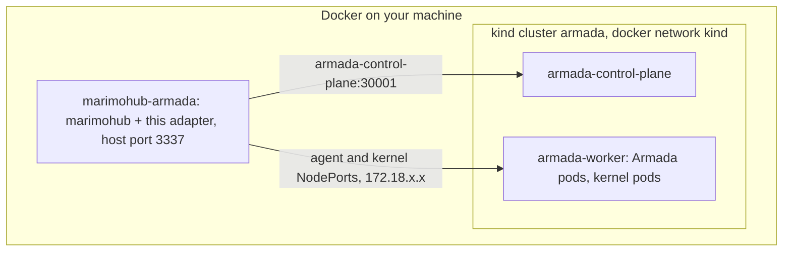

# Contributing

How to build, check and run this adapter, and what to update when you change it.

## Toolchain

- **Bun** runs the scripts, tests and the bundler.
- **Node 24** is the runtime the bundle targets: it matches marimohub's
  `.node-version`. `@types/node` tracks the same major on purpose. `src/` is typed
  against Node only (`tsconfig.src.json`), so Bun globals cannot leak into shipped
  code; Bun types are available in `test/` alone.
- **Go 1.26** builds the agent (`agent/go.mod`, standard library only). Any Go that
  honours the `go` directive fetches the right toolchain.
- **golangci-lint v2.13+** lints and format-checks the agent (`agent/.golangci.yml`).
  A build older than the module's Go cannot typecheck it, so keep it current.
- **Docker** and a **kind** cluster with Armada in it, for anything live.

`mise.toml` pins the first four; `mise install` gets them in one go. Homebrew works
just as well (`brew install golangci-lint`, and Bun, Node and Go from their own formulae
or installers), as long as the versions match the ones `mise.toml` names.

## Commands

```bash
bun install
bun run check             # oxfmt, oxlint (type-aware), then golangci-lint fmt and run
bun run typecheck         # both tsconfigs
bun run test              # adapter tests, then go vet and go test
bun run build             # bundles src into dist/index.js, self-contained
bun run fmt               # formats TypeScript, Markdown, YAML and Go
bun run check:armada-api  # the wire types against the pinned Armada spec
bun run smoke             # one job against a running Armada, through the agent
```

CI (`.github/workflows/ci.yml`) runs `check`, `typecheck`, `test` and `build`, lints
and builds the agent in its own job, and verifies the Armada API contract when an
Armada-related file changed. Every GitHub Action is pinned to a full-length commit
SHA; keep it that way.

### Lint rules that cost time

- A custom rule requires an explicit type annotation on every variable, arrow
  function and parameter whose type is not a primitive, tests included.
- `no-await-in-loop` needs a `// oxlint-disable-next-line` with a reason, or a
  disable/enable pair around a loop.
- The agent's Linux-only file (`agent/reaper_linux.go`) is skipped by a macOS lint
  run; lint with `GOOS=linux golangci-lint run` before pushing, since CI is Ubuntu.

### The Armada API surface

`src/armada-types.ts` is hand-written rather than generated from Armada's swagger:
the four endpoints we call reach most of the spec's definitions, but almost all are
embedded Kubernetes types, and generating would mean re-reviewing thousands of lines
per Armada release. `bun run check:armada-api` keeps the hand-written types honest by
fetching `api.swagger.json` at the release in `.armada-version` and asserting every
field we depend on still exists with the type we read it as. When you read a new
field, add it to the manifest in `scripts/check-armada-api.ts`. To try a candidate
release: `ARMADA_VERSION=v0.23.0 bun run check:armada-api`.

### The bundle

`dist/index.js` is fully self-contained: marimohub imports it from wherever it is
mounted, with no `node_modules` beside it. It is about 40 KB; `@kubernetes/client-node`
is a dev dependency used for its pod spec types only, so nothing of it is bundled. The
bundle is deliberately not minified, because the useful error when a kernel fails to
start is a stack trace in marimohub's log.

To point a marimohub dev server at a local build:

```bash
# marimohub/apps/server/.env
MARIMOHUB_COMPUTE_BACKEND=library
MARIMOHUB_COMPUTE_LIBRARY=/absolute/path/to/marimohub-compute-armada/dist/index.js
```

## Running the whole thing locally

The Armada side comes from
[armada-operator](https://github.com/armadaproject/armada-operator): one
`make kind-all` gives you a kind cluster running the operator, Armada, and the
Pulsar, Postgres and Redis it depends on.



marimohub runs as an ordinary Docker container, not inside Kubernetes, joined to the
`kind` network so it can reach the NodePort addresses Armada reports. macOS cannot
route to those addresses, which is why the smoke script runs in a container too.

On a Linux host there is a shorter loop: `dev/run-native.sh` runs marimohub's
standalone `marimohub-linux-x64` binary on the host itself, pointed at `dist/index.js`,
with no marimohub image to build and nothing under emulation. The host reaches Armada
on the port kind maps to `localhost:30001` and the kernel pods on the docker network
directly. Both scripts start the same configuration, so a session behaves the same
whichever one you use.

### Apple Silicon

Armada publishes amd64-only images, as does marimohub and the default kernel image. All
run on an M-series Mac through Docker Desktop's binfmt handler, which the containerd
inside a kind node inherits, but a kernel under emulation is too slow to work in, so the
kernel image is built native arm64 and named in `MARIMOHUB_COMPUTE_IMAGE` (step 2). The
agent image is always built for the node.

### 1. Bring up Armada

```bash
git clone https://github.com/armadaproject/armada-operator
cd armada-operator
make kind-all
```

That creates the `armada` kind cluster, installs everything, writes
`~/.armadactl.yaml` and downloads `armadactl` to `./bin/app/armadactl`. It pulls
several GB the first time. The quickstart pins nothing: every Armada image is
`latest`, which today serves the same API as the release in `.armada-version`, but the
two can drift.

Host ports mapped by `hack/kind-config.yaml`: `30000` Lookout UI, `30001` Armada REST
API, `30002` Armada gRPC API. The quickstart sets `anonymousAuth: true`, so no
credentials are needed locally.

Confirm Armada works on its own before involving marimohub:

```bash
./bin/app/armadactl create queue example
./bin/app/armadactl submit dev/quickstart/example-job.yaml
./bin/app/armadactl watch example job-set-1
```

### 2. Build the kernel image and the agent image

marimohub needs a sandbox image with marimo and uv preinstalled. The adapter's default,
`ghcr.io/marimo-team/marimo-sandbox:latest`, is amd64 and public, so on an amd64 node
there is nothing to do: the node pulls it on the first session (1.7 GB, a few minutes
once). On an arm64 node it would run under emulation, and a Python kernel under qemu is
too slow to be useful, so build the upstream example native, load it into the cluster,
and name it wherever you start something:

```bash
docker build -t marimo-sandbox:local path/to/marimohub/examples/sandbox-image
kind load docker-image marimo-sandbox:local --name armada
export MARIMOHUB_COMPUTE_IMAGE=marimo-sandbox:local   # for smoke and both run scripts
```

The agent image is built from this repo for the worker node's architecture.
`dev/run-local.sh` does this itself; by hand:

```bash
docker build --platform linux/arm64 -t marimohub-kernel-agent:local agent
docker save marimohub-kernel-agent:local |
  docker exec -i armada-worker ctr -n k8s.io images import --platform linux/arm64 -
```

The import goes straight into the node's containerd because `kind load` trips over
multi-platform manifests from Docker Desktop's containerd image store.

Before submitting anything, confirm both images are in the node; a missing one leaves the
pod in `ImagePullBackOff` until Armada fails the job a couple of minutes later:

```bash
docker exec armada-worker ctr -n k8s.io images ls -q | grep marimo
```

If you bring your own kernel image, it must provide `/bin/sh` and `git`
(see [DECISIONS.md](DECISIONS.md)).

### 3. Check that placement works

```bash
bun run smoke            # submit, reach the agent, check for leaks, cancel
bun run smoke -- --keep  # leave it running to poke at
```

```
submitting smoke-mtr8nhti to queue "marimohub" at http://armada-control-plane:30001
  kernel image ghcr.io/marimo-team/marimo-sandbox:latest
  agent image  marimohub-kernel-agent:local
  agent   172.18.0.2:32114

running and answering after 16.8s
  cluster Cluster1
  pod     default/armada-01m1xypqftnw12bt27vyxtwksd-0
  node    armada-worker

running a command in it
  hello from armada-01m1xypqftnw12bt27vyxtwksd-0
  Python 3.13.15
  PID 1 is /mh-agent/agent--port8718
  ok: exec through the agent
```

That exercises the config, the auth header, the pod spec with its init container, the
submit, the event stream, the address event for both ports, and the agent itself. It
then writes, reads and lists a file with a hostile name through the agent's `/files`
endpoints, starts a detached server and waits for its port (once over TCP, once as an
HTTP readiness check on a path, the way a surface does), looks at it with
`isPortReady`, kills it, exposes the kernel port and a surface port (the smoke enables
the `vscode` surface, so the pod declares 8443 and `multiPort` is on) and checks the two
URLs differ, starts a process that crashes at once, and finally abandons a command by
timing it out and cancels a stream mid-command. A healthy run shows every check pass and lists no process left
behind, zombies included: the agent kills what its callers abandon and reaps the rest.
Anything else exits non-zero.

`bun run smoke` runs `dev/smoke.ts` inside a bun container on the `kind` network
(`dev/smoke.sh`). On a Linux host that can reach that network, run the script
directly.

### 4. Start marimohub with this adapter

```bash
./dev/run-local.sh     # in a container, works everywhere
./dev/run-native.sh    # on the host, Linux x86-64 only
```

`run-local.sh` bundles the adapter, builds and imports the agent image, bakes the bundle
into `marimohub-armada:dev`, creates the `marimohub` queue, starts the container on
port 3337 joined to the `kind` network with `fs` storage, `dev` auth and `proxy`
sandbox exposure, and polls `/api/health` until it answers. It sets
`MARIMOHUB_RUN_MAINTENANCE=true`, since marimohub runs its session lifecycle (the
periodic snapshot, idle reaping) only on a replica that asks to, and a single dev
process is that replica. Sessions are snapshotted every 5 seconds instead of
marimohub's 2 minutes, with the lifecycle sweep that fires the snapshot at the same
pace, so an edit saved in the editor reaches storage within seconds; `MARIMOHUB_SESSION_SNAPSHOT_INTERVAL_SECONDS` and
`MARIMOHUB_SESSION_SWEEP_INTERVAL_SECONDS` override both. No credential of any kind
is mounted. Override with `ARMADA_URL`, `ARMADA_QUEUE`, `ARMADA_NAMESPACE`, `PORT`,
`IMAGE`, `AGENT_IMAGE`, `CONTAINER`, `ARMADACTL` and `NODE`; `ARMADA_EXPOSE` and the
`ARMADA_INGRESS_*` variables pass through too (step 6), as do `ARMADA_LOOKOUT_URL`, the
two queue maps (step 7) and `MARIMOHUB_SURFACES`.

`run-native.sh` does the same without the marimohub image: it downloads the release
binary matching the Dockerfile's base image into `dev/bin/` once (checked against its
published sha256), builds the bundle and the agent image, creates the queue, and runs
the binary in the foreground with `MARIMOHUB_COMPUTE_LIBRARY` pointing at
`dist/index.js`. The log is on the terminal and Ctrl-C stops it. Notebooks live in
`dev/data/` and the binary unpacks itself under `~/.cache/marimohub-sea/`. The same
variables apply, except `IMAGE` and `CONTAINER`; `DATA` moves the storage root, and
since every variable in the environment reaches the process, anything the README lists
can simply be exported. The two scripts keep separate storage (a Docker volume against
`dev/data/`), so notebooks made under one are not seen by the other.

### 5. What you should see

marimohub comes up at <http://localhost:3337>, signed in as the dev user. Browsing and
creating notebooks never touch compute. Opening a notebook runs the whole provision
sequence: the job is submitted, the pod runs, the agent answers, files and environment
go in, `uv sync` runs, the kernel is started as the agent's own child and its port is
waited for in-pod, and `exposePort` returns the NodePort address. A warm start takes
about 12 seconds.

The browser reaches the kernel through marimohub's proxy at `/proxy/<token>/...`,
because the NodePort address is on the docker network. The marimo editor loads through
it, websocket included, and autosaves.

When a start fails, the notebook shows a generic "Sandbox compute backend is not
available" with a Retry button; the real error is nested in the server log:

```bash
docker logs marimohub-armada 2>&1 | grep request_error | tail -1 | jq -r '.error.cause.message'
```

With `run-native.sh` the log is the terminal: pipe it to a file and `grep` that. A
start in the first minute after `make kind-all` fails with `Number of nodes in
cluster: 0`, because the executor has not reported the worker to the scheduler yet;
Retry, or wait and start again.

The `session_provision` log line reports each step's timing and which succeeded.
marimohub compensates cleanly on a failed start, so Retry is safe.

### 6. Through an ingress

Everything above reaches the pod over NodePorts. Production reaches it over an Ingress
(`ARMADA_EXPOSE=ingress`), and the kind cluster can do that too:

```bash
./dev/ingress-local.sh
ARMADA_EXPOSE=ingress bun run smoke
ARMADA_EXPOSE=ingress ./dev/run-local.sh    # or ./dev/run-native.sh
```

The script installs ingress-nginx from kind's manifest (pinned; its current version
carries no `ingress-ready` node selector, so the script pins the controller to the
worker node itself), patches the executor's `podDefaults.ingress.hostnameSuffix` to
`<worker-ip-with-dashes>.sslip.io` so every hostname Armada generates resolves to the
worker with no DNS of our own, waits for the executor to roll, and issues a self-signed
wildcard certificate for `*.default.<suffix>` into the secret Armada's defaults name
(`default-ingress-tls-certificate`). The CA lands in `dev/tls/` (gitignored); both dev
scripts mount it and set `NODE_EXTRA_CA_CERTS` when it exists. Rerunnable.

What you should see: the smoke prints the agent at
`https://kernel-8718-armada-<job>-0.default.172-18-0-2.sslip.io` and passes every check.
During a browser session `kubectl get ingress,svc` shows one ClusterIP service and one
Ingress with two hosts and a TLS entry; the `session_provision` line reports
`provision_reachable_ms` around 24000; and after Stop all three objects are gone. The
controller's log (`kubectl -n ingress-nginx logs deploy/ingress-nginx-controller`) shows
the editor's assets served and, once the session ends, one `101` line for the websocket
whose request time is the whole session.

### 7. A queue per owner

Everything above submits to the one `marimohub` queue. To see the owner map work, give
the cluster a second queue and tell the smoke whose sandbox it is submitting:

```bash
./bin/app/armadactl create queue marimohub-team-b   # in armada-operator; wait ~10s
ARMADA_LOOKOUT_URL=http://armada-control-plane:30000 \
ARMADA_QUEUE_BY_PROJECT='{"proj-b":"marimohub-team-b"}' \
SMOKE_OWNER_PROJECT=proj-b bun run smoke
```

A map needs `ARMADA_LOOKOUT_URL`; `readConfig` refuses one without it, and the smoke
checks for it before submitting so a misconfigured run leaves nothing behind.

What you should see: `queue   marimohub-team-b` under the placement line, and at the
end, instead of a plain cancel, a second provider that knows only the sandbox id listing
it among the active jobs of both queues and cancelling it in the right one after asking
Lookout, then `listActive` no longer showing it. A submit in the first seconds after
`create queue` fails with a 403 `could not find queue`, because the server's queue cache
has not refreshed yet; run it again.

The same through the hub, which names the owner from 0.4.0 onwards (the Dockerfile's base
image is 0.4.2). Map the dev project's id, the `id` in `curl localhost:3337/api/v1/projects`,
restart, and start a session through the API (dev auth accepts a bare request):

```bash
ARMADA_LOOKOUT_URL=http://armada-control-plane:30000 \
ARMADA_QUEUE_BY_PROJECT='{"<project id>":"marimohub-team-b"}' ./dev/run-local.sh
curl -X POST localhost:3337/api/v1/projects/<pid>/notebooks/<nid>/sessions \
  -H 'content-type: application/json' -d '{}'
```

What you should see: the job in `marimohub-team-b` in Lookout (<http://localhost:30000>)
while the session runs, `CANCELLED` there once it is stopped (`DELETE` on the same path
with `/<session id>` appended), and nothing left in the namespace. A session the hub still
records as running is reused as-is (`"reused": true`, nothing submitted), so after a hub
restart stop the stale ones first. `dev/smoke.sh` passes `ARMADA_LOOKOUT_URL`, the two
queue maps and the `SMOKE_OWNER_*` variables through as well.

### Inspecting and tearing down

```bash
./bin/app/armadactl get queues               # queues
./bin/app/armadactl watch <queue> <job-set>  # job events; the job set is the sandbox id
./bin/app/armadactl cancel job-set <queue> <job-set>
kubectl get pods -n armada                   # Armada's own components
kubectl get pods -n default                  # kernel pods
docker logs -f marimohub-armada              # marimohub, including adapter errors
```

Lookout UI: <http://localhost:30000>. To tear down, `./dev/shutdown.sh` removes the
marimohub container and deletes the kind cluster; `./dev/shutdown.sh --purge` also drops the
data volume, the dev images, `dev/tls`, and the binary and data of `run-native.sh`
(`dev/bin`, `dev/data`).

## Changing things

- **Upstream semantics are transcribed, never invented.** marimohub's
  `packages/compute-kubernetes` and `packages/compute-commons` are the reference for
  every sandbox operation, and its compute contract tests are the behavioural
  authority. Check the consumers of a result before choosing its shape.
- **Every design decision goes in `docs/DECISIONS.md`**, with the evidence cited
  against the Armada source at the release in `.armada-version`. A deliberate
  divergence from marimohub's own adapters is recorded there too. When a decision is
  replaced, rewrite it rather than appending a note: the file records the design as it
  is, not its history.
- **Verify live before calling it done.** Unit tests stub the channel; the smoke run
  and a notebook session in a browser are what prove a change against a real Armada.
  If a change rests on something not yet verified, add it to the list at the end of
  `docs/DECISIONS.md`.
- **Keep the docs current.** `docs/ARCHITECTURE.md` when the shape changes, this
  file when the dev loop changes, the README's configuration table when a variable
  is added.
- **Branch and pull request, squash-merged.** Commit messages are imperative
  summaries of one batch of work.
